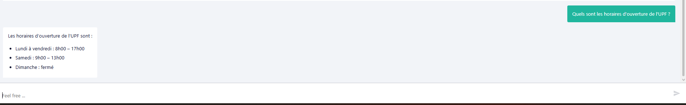
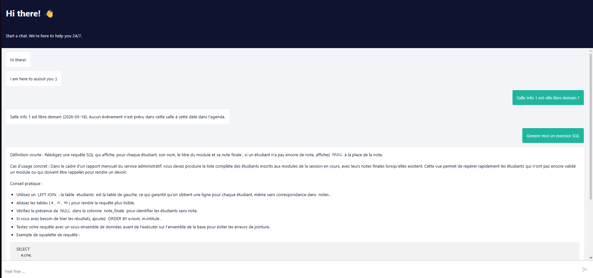
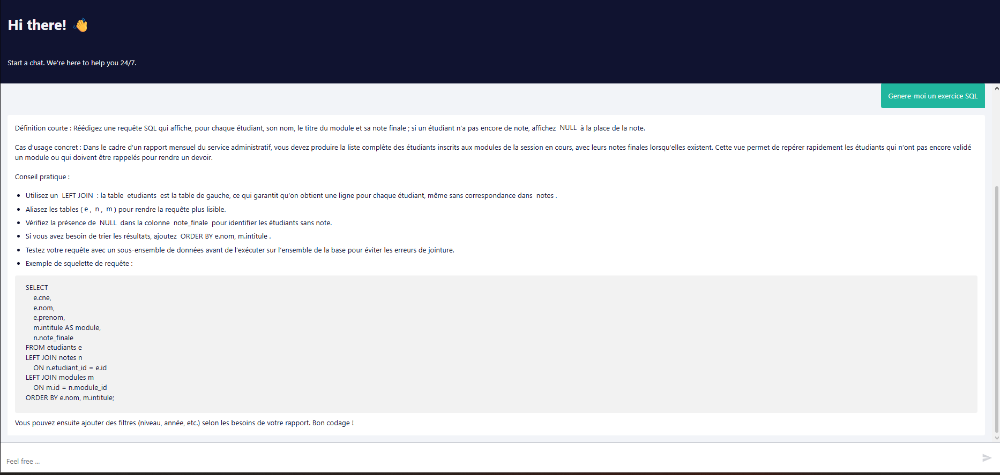

# 🎓 Smart UPF — Système Multi-Agents IA 

> Assistant intelligent pour l'Université Privée de Fès, construit avec **n8n**, **Groq LLM** et **Model Context Protocol (MCP)**.


---

## 📌 Présentation

**Smart UPF** est un assistant conversationnel multi-agents capable de répondre aux questions des étudiants, enseignants et personnel administratif sur tout le périmètre de la vie académique.

Il illustre concrètement les concepts suivants :
- Orchestration d'agents IA spécialisés (pattern **Orchestrator-Workers**)
- Accès à des données locales via le **Model Context Protocol (MCP)**
- Mémoire conversationnelle par session
- Déploiement local avec exposition publique via **ngrok**

---

## 🏗️ Architecture

```
User (Web Chat)
        │
        ▼
┌────────────────────────────┐
│        ORCHESTRATOR        │
│  Intent Detection + Routing│
│   Groq llama-3.1-8b        │
└──────────┬─────────────────┘
           │
 ┌─────────┼──────────┐
 ▼         ▼          ▼
Agent   Agent      Agent
Accueil Pédagogique Planning
 │         │            │
 │         │            ▼
 │         │     Google Calendar
 │         │     Session Booking
 │         │     Classroom Reserve
 │         │
 └─────────┴─────>
                 │
                 ▼
     ┌───────────────────────┐
     │   MCP Filesystem      │
     │  (port 3002 / SSE)    │
     │  docs/                │
     │  ├── faq-upf.md       │
     │  ├── guide-pfe.md     │
     │  ├── reglement.md     │
     │  ├── sql-jointures.md │
     │  └── agenda-upf.json  │
     └───────────────────────┘
```

---

## 🤖 Les 4 Workflows n8n

| Workflow | Rôle | Modèle LLM | Outils MCP |
|----------|------|-----------|------------|
| `orchestrator` | Triage et routage des questions | `llama-3.1-8b-instant` | — |
| `agent_accueil` | FAQ, inscriptions, contacts, règlement | `llama-3.3-70b-versatile` | `read_text_file` |
| `agent_pedagogique` | Cours SQL, algorithmique, exercices | `llama-3.3-70b-versatile` | `read_text_file` |
| `agent_planning` | Emplois du temps, salles, soutenances | `llama-3.3-70b-versatile` | `read_text_file` |
| `agent_planning` | Create my SQL revision session Friday 4PM | `llama-3.3-70b-versatile` | - |

### Règles de routage (Orchestrateur)

| Question exemple | Agent ciblé |
|-----------------|-------------|
| "Explique-moi les LEFT JOIN" | `agent_pedagogique` |
| "Quand est ma soutenance ?" | `agent_planning` |
| "Quel est l'emploi du temps des L3 INF ?" | `agent_planning` |
| "Quels sont les horaires d'ouverture ?" | `agent_accueil` |
| "Comment m'inscrire en M1 ?" | `agent_accueil` |
| "Create my SQL revision session Friday 4PM" | `agent_accueil` |

---

## 📋 Prérequis

- [Node.js](https://nodejs.org/) v18+
- [n8n](https://n8n.io/) (Community Edition)
- Compte [Groq](https://console.groq.com/) (gratuit)
- Connexion internet pour l'API Groq
- Google Account
- Google Calendar credentials


---

## 🚀 Installation & Démarrage

### 1. Cloner le projet

```bash
git clone https://github.com/TON_USERNAME/smart-upf.git
cd smart-upf
```

### 2. Créer le dossier de documents

```bash
mkdir C:\Users\%USERNAME%\Desktop\docs
```

Placer les fichiers suivants dans ce dossier :
- `faq-upf.md`
- `guide-pfe.md`
- `reglement.md`
- `sql-jointures.md`
- `agenda-upf.json`

### 3. Importer les workflows dans n8n

1. Ouvrir n8n : `http://localhost:5678`
2. Aller dans **Workflows → Import**
3. Importer dans cet ordre :
   - `agent_accueil.json`
   - `agent_pedagogique.json`
   - `agent_planning.json`
   - `orchestrator.json`
4. Dans l'orchestrateur, re-sélectionner les 3 sous-workflows depuis le dropdown (les IDs changent à chaque import)

### 4. Configurer les credentials Groq

1. Dans n8n → **Credentials → New**
2. Type : **Groq API**
3. Coller votre clé API depuis [console.groq.com](https://console.groq.com/)
4. Lier ce credential aux nœuds `Groq Chat Model` de chaque workflow

---
📅 Configure Google Calendar
Step 1 — Create Google Cloud Project

- Go to:
https://console.cloud.google.com/

Create: New project
- Enable Google Calendar API

Step 2 — OAuth Credentials

Create:

OAuth Client ID
Web Application

Authorized Redirect URI:

- http://localhost:5678/rest/oauth2-credential/callback
Step 3 — Add Credentials in n8n

Inside n8n:

Credentials
New Credential
Google Calendar OAuth2 API
Connect Google account

## ▶️ Lancer le système

Ouvrir **3 terminaux** simultanément :

**Terminal 1 — n8n**
```bash
n8n start
```

**Terminal 2 — Serveur MCP Filesystem**
```bash
npx -y mcp-proxy@latest --port 3002 --shell -- npx -y @modelcontextprotocol/server-filesystem "C:\Users\%USERNAME%\Desktop\docs"
```

**Terminal 3 — Exposition publique (optionnel)**
```bash
ngrok http 5678
```

Puis activer les 4 workflows dans n8n (toggle vert).

---

## 💬 Utilisation

Ouvrir l'interface chat :
```
http://localhost:5678/webhook/{WEBHOOK_ID}/chat
```

Ou via l'URL ngrok publique partagée par votre instance.

### Exemples de prompts

```
Quels sont les horaires d'ouverture de l'UPF ?
Explique-moi les LEFT JOIN en SQL
Quel est l'emploi du temps des L3 INF ?
Quand est la soutenance de Salma Benali ?
Comment s'inscrire en M1 ?
Génère-moi un exercice SQL sur les jointures
```
### tous les prompts de google agenda possible
Cours (EVT001, EVT002):

```
Ajoute au calendrier le cours SQL du 12 mai
Exporte le cours React Native du 12 mai
Mets dans mon agenda les cours du 12 mai
Ajoute tous les cours au calendrier
```

TP (EVT003): 

```
Ajoute au calendrier le TP bases de données du 13 mai
Exporte le TP du 13 mai dans mon agenda
Mets le TP M1 dans mon calendrier
```

Soutenances (EVT004, EVT005)

```
Ajoute au calendrier la soutenance de Salma Benali
Exporte la soutenance de Mehdi Fassi
Mets dans mon agenda toutes les soutenances
Ajoute les soutenances PFE au calendrier
```

Examen (EVT006)

```
Ajoute au calendrier l'examen d'algorithmique
Exporte l'examen du 26 mai dans mon agenda
Mets l'examen S2 dans mon calendrier
```

Réunion (EVT007)

```
Ajoute au calendrier la réunion pédagogique du 15 mai
Exporte la réunion filière INF
Mets la réunion dans mon agenda
```

Conférence (EVT008)

```
Ajoute au calendrier la conférence IA
Exporte la conférence du 20 mai
Mets la conférence IA et Education dans mon agenda
```

Tout exporter

```
Ajoute tous les événements au calendrier
Exporte tout l'agenda UPF dans Google Calendar
Mets tous les événements dans mon agenda
```


---

## 📁 Structure du projet

```
smart-upf/
├── workflows/
│   ├── orchestrator.json
│   ├── agent_accueil.json
│   ├── agent_pedagogique.json
│   └── agent_planning.json
├── docs/
│   ├── faq-upf.md
│   ├── guide-pfe.md
│   ├── reglement.md
│   ├── sql-jointures.md
│   └── agenda-upf.json
└── README.md
```
## 📸 Démonstration

### Agent Accueil — Horaires d'ouverture


### Agent Planning — Disponibilité des salles


### Agent Pédagogique — Exercice SQL généré


---

## 🔧 Dépannage

| Problème | Cause probable | Solution |
|----------|---------------|----------|
| `Workflow is not active` | Workflow non activé | Activer le toggle dans n8n |
| `Failed to find workflow` | IDs obsolètes après import | Re-sélectionner via dropdown dans l'orchestrateur |
| Réponse vide ou fallback | Chemin MCP incorrect | Vérifier les paths dans les system prompts |
| `Rate limit` / `Bad model` | Mauvais nom de modèle Groq | Utiliser `llama-3.3-70b-versatile` |
| `MCP connection failed` | Serveur MCP non démarré | Lancer le Terminal 2 |
|Google Calendar auth failed|OAuth misconfigured|Reconnect credentials|

---

## 🛠️ Stack technique

| Composant | Technologie |
|-----------|------------|
| Orchestration | [n8n](https://n8n.io/) Community Edition |
| LLM | [Groq](https://groq.com/) — Llama 3.1 / 3.3 |
| Protocol outils | [MCP](https://modelcontextprotocol.io/) (Model Context Protocol) |
| Serveur MCP | `@modelcontextprotocol/server-filesystem` |
| Proxy MCP→SSE | `mcp-proxy` |
| Tunnel public | [ngrok](https://ngrok.com/) |
| Mémoire | n8n Window Buffer Memory |
|Google Calendar auth creadentials |[Reconnect credentials](https://console.cloud.google.com/)|

---
Future Improvements

Planned features:

-📧 Email notifications
-📱 WhatsApp integration
-🏫 Real classroom availability system
-🧠 Vector database integration
-🔊 Voice assistant
-📊 Analytics dashboard
-🎯 Student personalization
---

## 👨‍💻 Auteur

Projet réalisé dans le cadre du cours **Systèmes Multi-Agents IA** by me— 4ème année Génie Informatique, UPF 2025-2026.

---

## 📄 Licence

MIT — libre d'utilisation à des fins pédagogiques.
